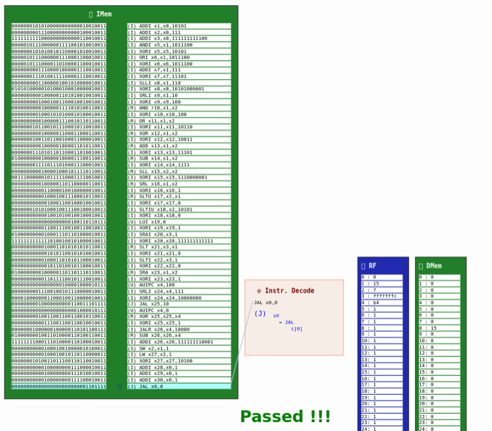

# Building a RISC-V CPU Core

## Course Description

This free mini-workshop, offered by by [Steve Hoover](https://www.linkedin.com/in/steve-hoover-a44b607/) of [Redwood EDA, LLC](https://redwoodeda.com), [Linux Foundation](https://www.linuxfoundation.org/), and [RISC-V International](https://riscv.org) is a crash course in digital logic design and basic CPU microarchitecture. Using the Makerchip online integrated development environment (IDE). Implementation started from logic gates to a simple, but complete, RISC-V CPU core using freely-available online tools for open-source development. 

This course is available [in this repository](https://github.com/stevehoover/LF-Building-a-RISC-V-CPU-Core-Course/blob/main/course.md) as well as via the [EdX platform](https://www.edx.org/course/building-a-risc-v-cpu-core) (with a certification option). 

## Finished!
Successfully completed the course with implemetation for all the RISC-V Operations. This included the Fetch -> Decode -> Register Read -> ALU -> Register Write. Also implemented a generic full-word load and store operation.

